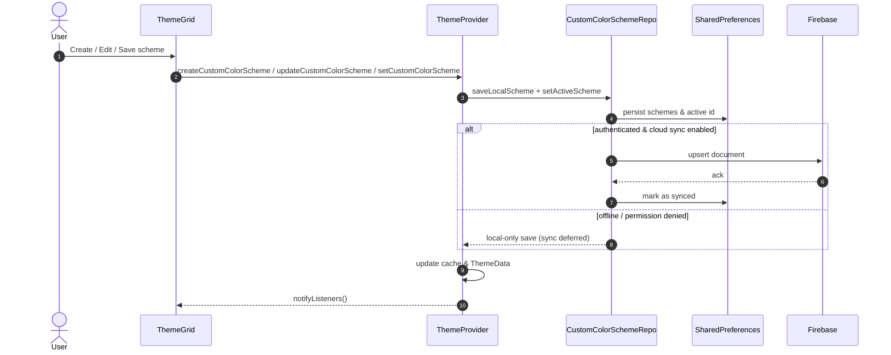
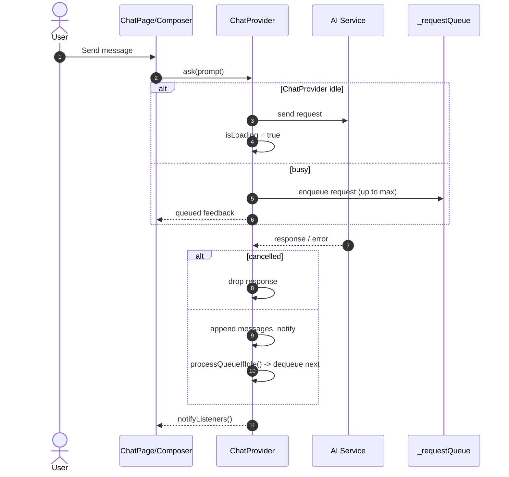

Stop me if this sounds familiar — you’re in the middle of a chat, switching between notes, and suddenly something feels… off. Maybe a chat doesn’t save properly. Maybe the interface feels a little cramped. You love what MS Bridge does, but you know it could flow smoother.

That’s exactly what version **8.3** is about — smoothing the edges, refactoring the core, and giving you more control over how MS Bridge looks and feels.

This update isn’t just a patch. It’s a major leap in how the app works under the hood. We’ve rewritten core code to make it modular, cleaned up old UI layouts, and made sure your settings sync perfectly across devices with **Firebase integration**.

In this post, you’ll get a clear look at what’s changed, why it matters, and how these improvements make your everyday MS Bridge experience faster, cleaner, and more reliable.

## **Core Improvements: A Cleaner, Modular Foundation**

Every good update starts with solid code. In version **8.3**, we’ve taken a big step toward long-term stability by refactoring the app’s old codebase and making it modular.

What does that mean for you?
It means the app runs smoother, loads faster, and is easier to maintain and expand in future updates. By splitting large, single files into smaller, focused modules, we’ve reduced clutter behind the scenes — so when new features roll out, they integrate cleanly without breaking other parts of the app.

Think of it as rebuilding the foundation of a house. You might not see all the work at first glance, but you’ll feel it in the app’s responsiveness, stability, and overall flow.

## **Custom Colours and a Fresh UI Experience**

Your workspace should feel like *yours*, not just another app window. That’s why MS Bridge 8.3 introduces **custom colour options** — giving you the freedom to personalise the interface to suit your style or mood. Whether you prefer something light and minimal or bold and vibrant, the app now adjusts to you, not the other way around.

We’ve also given the **core screens a refresh**.

* The **Chat UI** has been redesigned for a cleaner, more modern look that makes conversations flow naturally.
* The **Notes App Bar** now comes with more options and improved layout, making it easier to access key tools without breaking focus.

These visual tweaks aren’t just about aesthetics — they’re about usability. Every change is designed to make your experience smoother, faster, and more intuitive.

## **Cloud Sync and Smarter Settings**

You asked, and we listened. With version **8.3**, all your app settings are now backed up and synced with **Firebase Cloud**.

That means your preferences — from colour themes to layout choices — stay with you, no matter where you log in. If you reinstall the app or switch to a new device, your personalised setup comes right back the moment you connect to the cloud.

No more reconfiguring. No more “starting fresh.” Just pick up where you left off, exactly how you like it.

This improvement is a small change on paper but a big one in practice. It makes MS Bridge feel more seamless and dependable — the way a modern, cloud-connected app should.

## **Chat Logic Overhaul and Bug Fixes**

One of the biggest behind-the-scenes upgrades in version **8.3** is the complete rework of the **chat composer** and **chat logic**.

During testing, we discovered that message streaming wasn’t always behaving as expected — sometimes messages wouldn’t load in the correct order, and on rare occasions, chat history wouldn’t save at all. These issues have been fully resolved.

We rebuilt the chat system to handle message flow more efficiently and reliably. The result? Faster message delivery, smoother scrolling, and a more stable overall experience.

The **Chat UI** now matches this new logic perfectly. You’ll notice cleaner transitions, improved message spacing, and an interface that feels lighter and more natural to use.

This update isn’t just about fixing bugs — it’s about making every conversation feel effortless.

## **Template UI and Refactoring Work**

The **Template UI** also got the attention it deserved in version **8.3**. Previously, all its code lived in a single file — which made updates tricky and slowed down performance in some cases.

We’ve now **refactored the entire Template UI**, breaking it into smaller, cleaner components. This makes it easier to maintain, quicker to load, and far simpler to expand in future releases.

You’ll also notice a subtle visual polish throughout the templates — cleaner spacing, better structure, and a smoother overall experience when creating or editing. It’s the kind of improvement you might not notice right away, but it makes everything feel more consistent and professional.

## **A Better MS Bridge — Inside and Out**

MS Bridge 8.3 isn’t just another version — it’s a step forward in how the app is built and how it feels to use. From a **modular core** that boosts stability, to **personal colour themes**, a **redesigned chat and notes experience**, and **cloud-synced settings**, this update lays the groundwork for a smoother, smarter future.

Every change — big or small — comes from listening to how you use MS Bridge day-to-day. The goal is simple: to make your workspace faster, cleaner, and more personal.

So go ahead — update to **version 8.3** today and experience the difference for yourself.

👉 [Update to MSBridge 8.3](/downloads/ms-bridge-8.3.0.apk)

👉 [Pull Request](https://github.com/rafay99-epic/MSBridge/pull/26)
